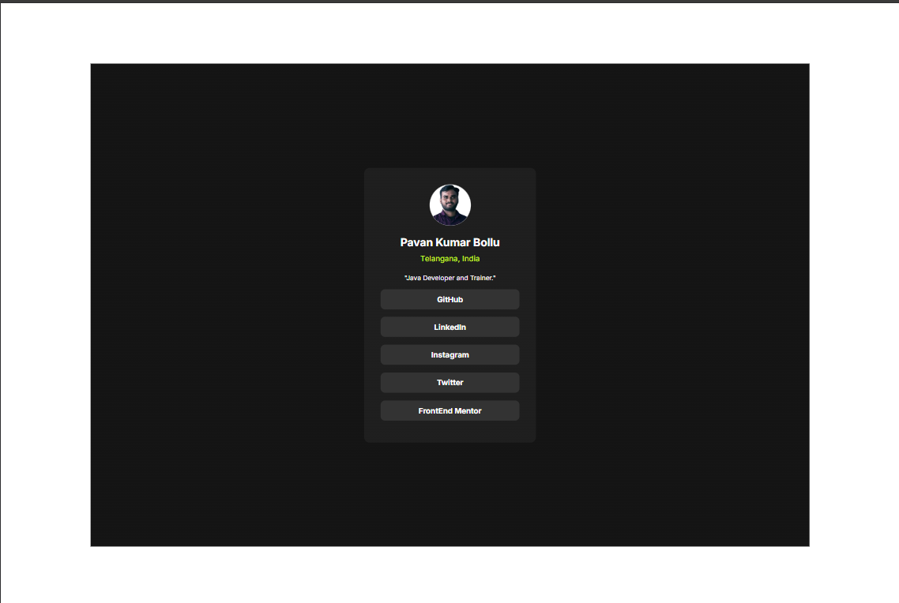
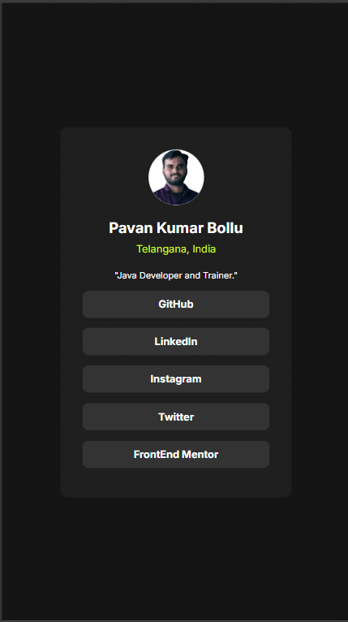
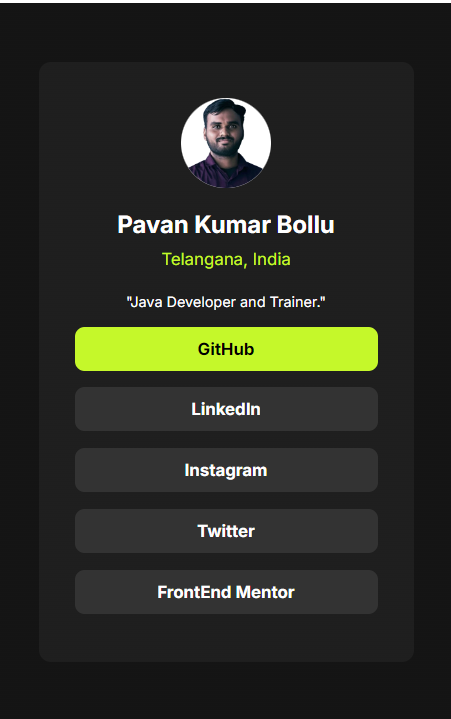

# Blog preview card solution

This is a solution to the [Social-Links-container] which i have developed to improve my coding skills by building this projects. i have learnt how make the items center to the page and use the shadows and so on.

## Table of contents

- [Overview](#overview)
  - [The challenge](#the-challenge)
  - [Screenshot](#screenshot)
  - [Links](#links)
- [My process](#my-process)
  - [Built with](#built-with)
  - [What I learned](#what-i-learned)
  - [Continued development](#continued-development)
  - [Useful resources](#useful-resources)
- [Author](#author)
- [Acknowledgments](#acknowledgments)

**Note: Delete this note and update the table of contents based on what sections you keep.**

## Overview

### The challenge

Users should be able to:

- See hover and focus states for all interactive elements on the page

### Screenshot


#### Please find the Screen shot of the desktop Preview



####  Mobile preview 



### Hover and Active Effects




### Links

- Solution URL: (https://github.com/PavanOther/Social-Links-Profile)
- Live Site URL: (https://pavanother.github.io/Social-Links-Profile/)

## My process

### Built with

- Semantic HTML5 markup
- CSS custom properties
- Flexbox
- CSS Flex
- CSS meadia Quaries

### What I learned

By Building this Project i have learnt the Front end Technoliges HTML Css and how to add the Hover and active effects and how to make content to center by using the css

i Have writtened some media quaries which helped me make the project responsive.


### HTML Code
```html
<!DOCTYPE html>
<html lang="en">
<head>
    <meta charset="UTF-8">
    <meta name="viewport" content="width=device-width, initial-scale=1.0">
    <link rel="stylesheet" href="styles.css">
    <link rel="icon" href="./assets/BolluPavanKumar.png" type="image/png">
    <title>SocialLinksProfile</title>
</head>
<body>
    
    <main class="main-container">
        <div class="container">
            <div class="profile-container">
                
            </div>
            <div class="name-container">
                <p class="name">Pavan Kumar Bollu</p>
                <p class="address">Telangana, India</p>
            </div>
            <div class="role-container">
                <p class="role">"Java Developer and Trainer."</p>
            </div>
            <div class="social-links-container">
                <a class="social-link" href="">GitHub</a>
                <a class="social-link" href="">LinkedIn</a>
                <a class="social-link" href="">Instagram</a>
                <a class="social-link" href="">Twitter</a>
                <a class="social-link" href="">FrontEnd Mentor</a>
            </div>
        </div>
    </main>

</body>
</html>
```

### Please Find the Css Code Below

```css
@import url('https://fonts.googleapis.com/css2?family=Inter:ital,opsz,wght@0,14..32,100..900;1,14..32,100..900&display=swap');

*, *::after, *::before
{
    font-family: "Inter", Georgia, 'Times New Roman', Times, serif;
    box-sizing: border-box;
    margin: 0;
    padding: 0;
    color:white;
}

body
{
    background-color: hsl(1, 1%, 100%);
    position: relative;
    height: 100vh;
}

.main-container
{
    background-image: linear-gradient(hsl(0,0%,8%) , hsl(0,0%,8%));
    position:absolute;
    top:10%;
    right: 10%;
    bottom: 10%;
    left: 10%;
}

.container
{
    background-image: linear-gradient(hsl(0,0%,12%), hsl(0,0%,12%));
    position: absolute;
    width: 250px;
    height: 400px;
    top: 0;
    right: 0;
    bottom: 0;
    left: 0;
    margin: auto;

    padding: 1.5rem 1.5rem;
    display: flex;
    flex-direction: column;
    align-items: center;
    border-radius: .5rem;
}

.profile-container
{
    width: 60px;
    margin-bottom: .7rem;
}
.profile
{
    width: 100%;
    border-radius: 50%;
    background-color: white;
}
.name-container
{
    text-align: center;
    margin-bottom: 1rem;
}

.name
{
    font-size: 1rem;
    font-weight: bold;
    margin-bottom: .4rem;
}
.address
{
    font-size: .7rem;
    color:hsl(75, 94%, 57%) ;
}
.role-container
{
    margin-bottom: .7rem;
}
.role 
{
    font-size:.6rem;
}

.social-links-container
{
    display: flex;
    flex-direction: column;
    flex-wrap: wrap;
    width: 100%;
}
.social-link 
{
    flex:1;
    background-color: hsl(0,0%,20%);
    padding:.5rem 1rem;
    border: none;
    border-radius: .4rem;
    margin-bottom: .7rem;
    text-decoration: none;
    font-size: .7rem;
    font-weight: bold;
    text-align: center;
}

.social-link:hover,
.social-link::after
{
    background-color: hsl(75, 94%, 57%);
    color: black;
}


@media screen and (max-width:900px)
{
    .main-container
    {
        top: 0;
        right: 0;
        bottom: 0;
        left: 0;
    }
}


```

### Continued development

I wanted continue my development in the frontend technologies like HTML CSS JavaScript and React JS.


## Author


**My Linked in Profile.**
- LinedIn - [Pavan Kumar Bollu ](https://www.linkedin.com/in/pavankumar0211/)


## Acknowledgments

Thanks to everyone who helped me to build this project.
